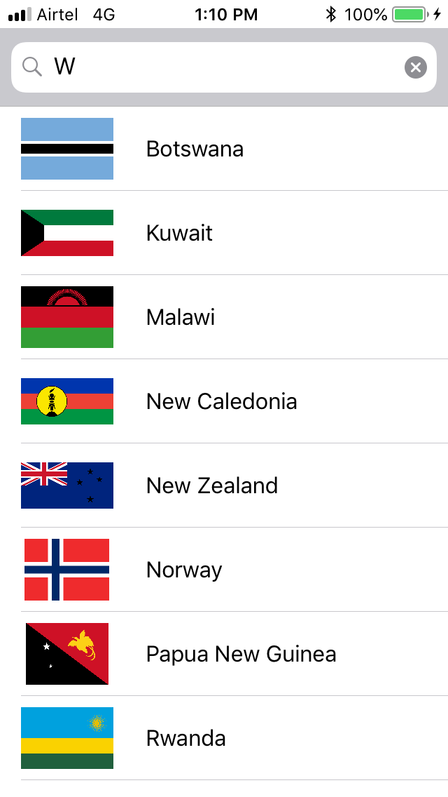
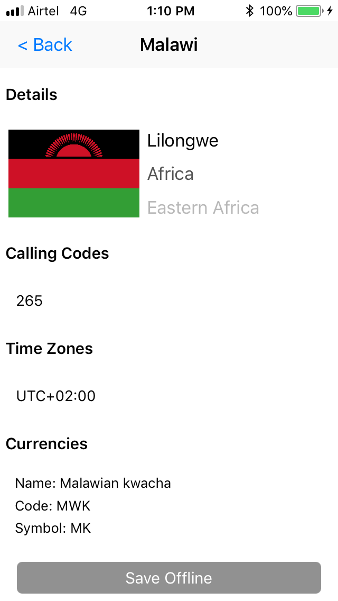
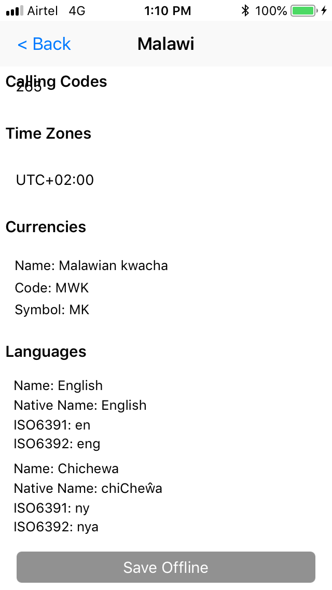

# Countries

<b>Development Information:</b> 
 XCode version: 10.1 
 Swift version: 4.2 
 Design Pattern : Model View Presenter(MVP) 
 UI Design: Storyboard and Autolayout 
 Unit Testing framework: Quick and Nimble 
 UI Testing framework: XCTest 
 Dependency Manager: Cocoapod 
 Persistence framework: CoreData 
 <b>Thirdparty Library:</b> 
    SwiftLint: To enforce swift style and conventions 
    Alamofire: To communicate restcountries server 
    ReachabilitySwift: To find network reachability 
    OHHTTPStubs: To create mock web service call for unit testing 
    SVGKit: To render svg file on UIImageView 
 
 <b>Architecture:</b> 
    <b>Presentation Layer:</b> 
        CountryTableViewCell.swift 
        CountryDetailTableViewCell.swift 
        CountryCurrenciesTableViewCell.swift 
        CountryLanguagesTableViewCell.swift 
        CountryViewController.swift 
        CountryDetailViewController.swift 
    <b>Business Layer:</b> 
        Countries.swift 
        CountryPresenter.swift 
    <b>Data Access Layer:</b> 
        CoreDataManager.swift 
        CountryService.swift 
  
 <b>Screenshots:</b> 

